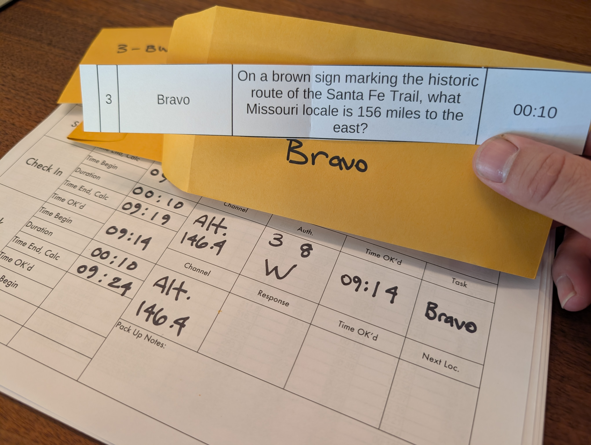
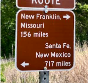

# Radio Rally
Radio Rally is a portable operating event for teams of amateur radio operators in a local area or region to develop and test skills used in contesting and emergency communications.

# Intro 
Radio Rally was developed over 2025 and 2026 by Darrell Krueger, KI4RXJ, as a fun and friendly team competition incorporating elements of amateur radio contests, portable operating, time-speed-distance (TSD) rallying, and emergency communications. Events are designed to be run by local radio clubs and can be easily scaled by time, geography, and radio license class.

Radio Rally was inspired by the RaDAR concept created by ZS6BNE in South Africa and promoted in the USA by N4KGL.

Radio Rally © 2026 by KI4RXJ Darrell Krueger is licensed under CC BY-NC-SA 4.0 

# Operation
Events are announced with a minimum of one to two months lead time. The event announcement will provide the operating area, headquarters location, a list of possible operating locations, and list the official event frequencies and modes. Teams of two to four people register and make necessary preparations.

[Event organizers, click here.](event_organizer.md)

A Radio Rally begins with a team briefing at the event headquarters and the event is conducted over multiple stages. A typical half-day event has three stages but can be adjusted by the organizer as desired. Every stage has the same structure: transit, set-up, check-in, task, and take-down. Upon completion of the stages, all teams return to the event headquarters to debrief and socialize with other teams.

Below is a quick overview. For detailed instructions, [click here.](detailed_instructions.md)

## Briefing
At the team briefing, the event organizer reviews the structure and rules of the event with the teams. Teams are provided a [packet of operating instructions](competitor_packet.md), containing necessary information to successfully complete the event. Approximately 10 minutes before the official start time, each team is provided their unique list of operating locations.

## Transit
Once the operating locations are released, each team uses the packet of operating instructions to plan a route to their first location and calculate their scheduled arrival time and their check-in window with net control.

## Set-up
Upon arrival at the operating location, teams are given an allotted setup time. Teams may use this time to set up their station and survey the area before their check-in window.

## Check-in
In their time window, teams contact net control on one of the official event radio channels and operating modes. Net control will authenticate the team, respond with the official time, and indicate which task must be performed by the team.

## Task
During check-in, net control indicates which task a team should perform at their location. Teams open the appropriate sealed envelope to reveal a simple scavenger-hunt-like task and an allotted time window to complete the task. Teams will communicate their response to net control and net control will respond with an official time and the team's next operating location.

## Take-down
After the task is communicated to net control, teams are allotted time for takedown of their station. This allotted time is used to determine the departure time to begin the next stage. This process repeats for each stage until the last stage, when teams return to the event headquarters.

## Debriefing
After their last stage, teams transit to the event headquarters to debrief on what went well and what could improve with their preparations and with the event operations. Teams can socialize while scores are tallied, and the organizer can recognize and reward the highest [scoring team](scoring.md).
