Radio Rally
=
Radio Rally is a portable operating event for teams of amateur radio operators in a local area or region to develop and test skills used in contesting and emergency communications.

Radio Rally © 2026 by KI4RXJ Darrell Krueger is licensed under CC BY-NC-SA 4.0 

Stage Instructions
=

Preparation
==

1. Assemble your crew

Form a team consisting of two to four people. A team must have at least one member who is currently licensed by the FCC.

2. Register

Register for the event using the link designated by the organizer.

3. Check for updates

Stay in communication with the event organizer through the event-specific email list or webpage.

4. Get your gear

Review the event channels and modes as they relate to the operating locations. What do you need to make sure your signal can make it to the HQ location? Do you need a mast? Do you need a high gain antenna? Do you need a directional antenna? Do you need a higher power radio or amplifier?

Review all your gear and make sure it is packable and portable. Do you have enough spares incase something happens?

Day-of-Event
==

Briefing
===
Arrive early at the HQ. The briefing will start on time. During the briefing the event organizer will go over the event format and schedule and answer questions. Approximately ten minutes before the designated start time, the organizer will issue each team a packet of operating instructions and a list of their operating locations. At this time, the team plans their route to the location and calculates their arrival time and check in window.

Packet contents
==

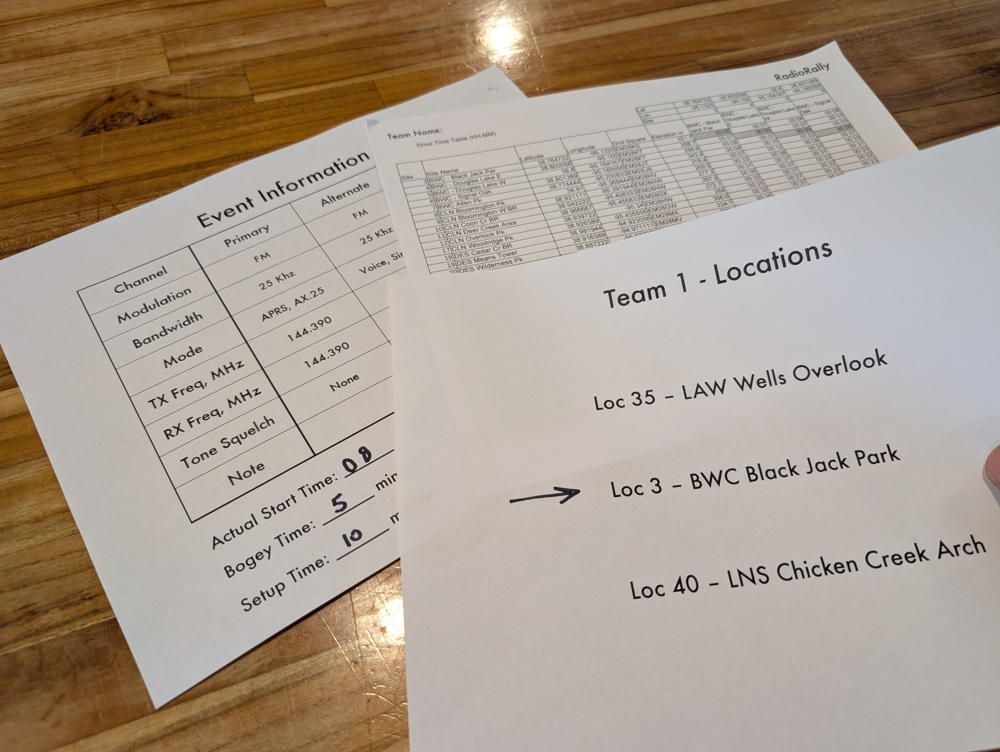

Look up transit time from the table

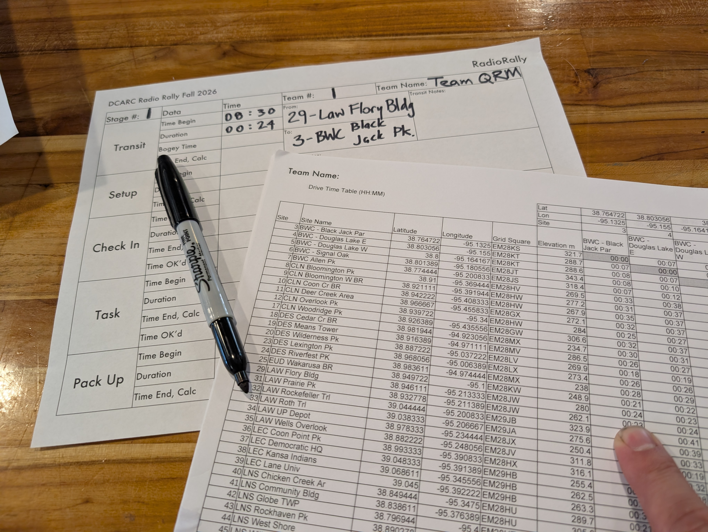

Add the bogey time. The bogey time is set by the organizer to adjust for weather or other factors affecting travel times.

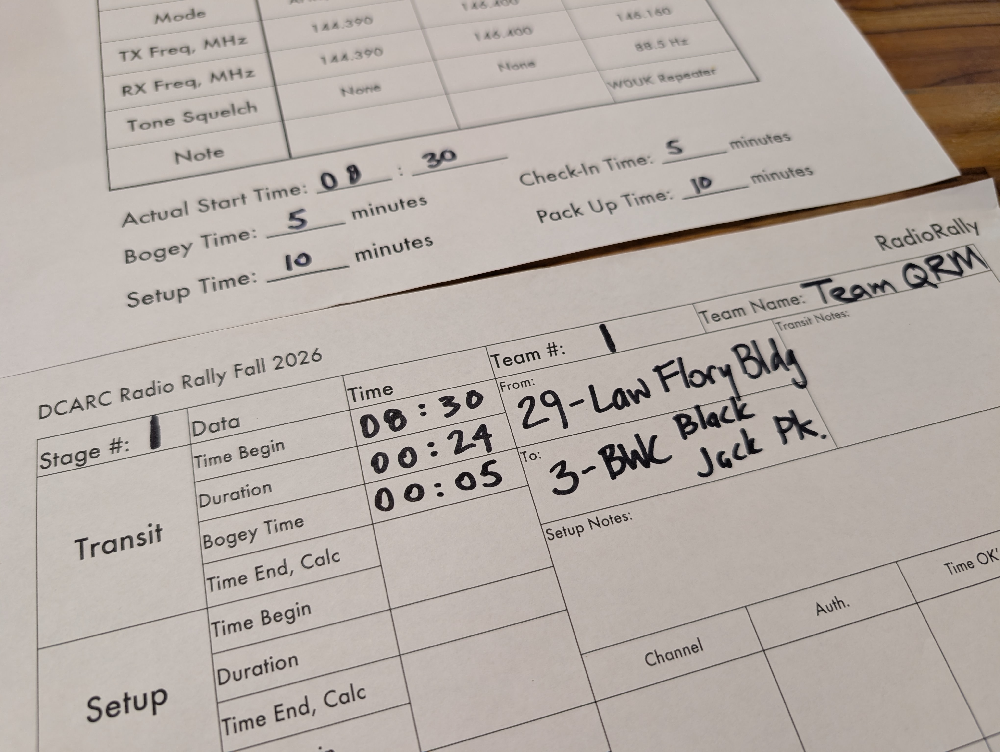

Calculate the start of the set-up window

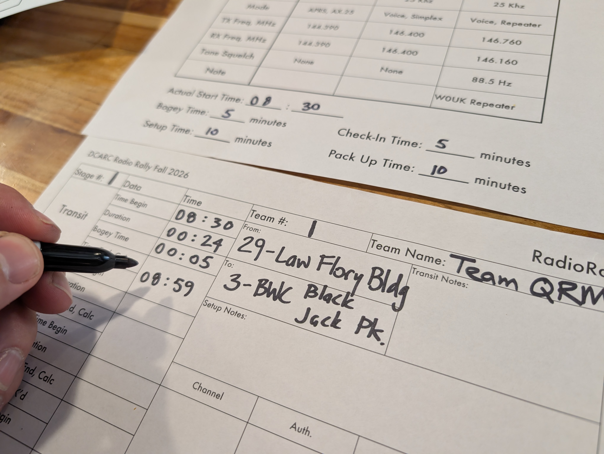

Calculate the start of the check in window

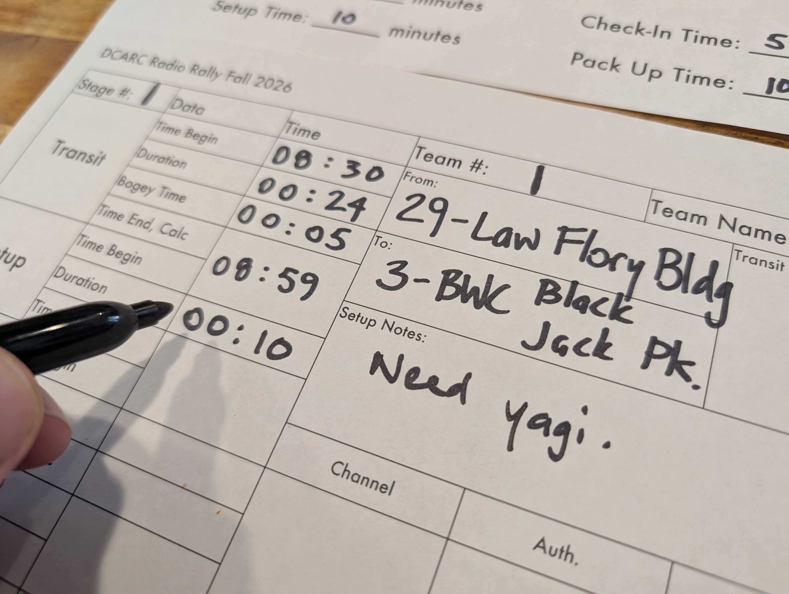

Calculate the end of the check in window

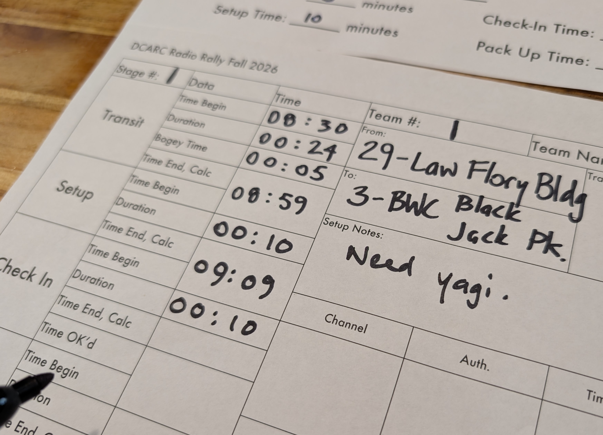
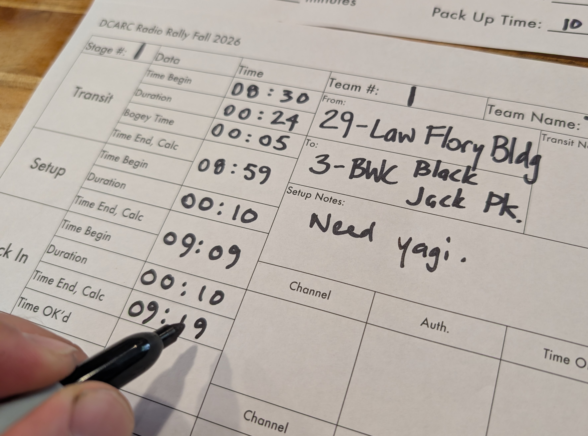

Transit
==
After you have calculated your check in window, your team will travel to the operating location. Use a mapping program of your choice. Obey all traffic laws and do not drive distracted.

Check-in
==
Choose a channel where you will call net control and complete your check-in within your time window. There is not a rigid format, but this script will help:

**Team:** “Radio Rally Net Control this is KI4RXJ calling for Team QRM.”

**Net Control:** “Net Control Answering, go ahead Team QRM.”

**Team:** “Team QRM checking in for Stage 1 at location 3.”

**Net Control:** “Roger, Team QRM, please authenticate three-eight.”

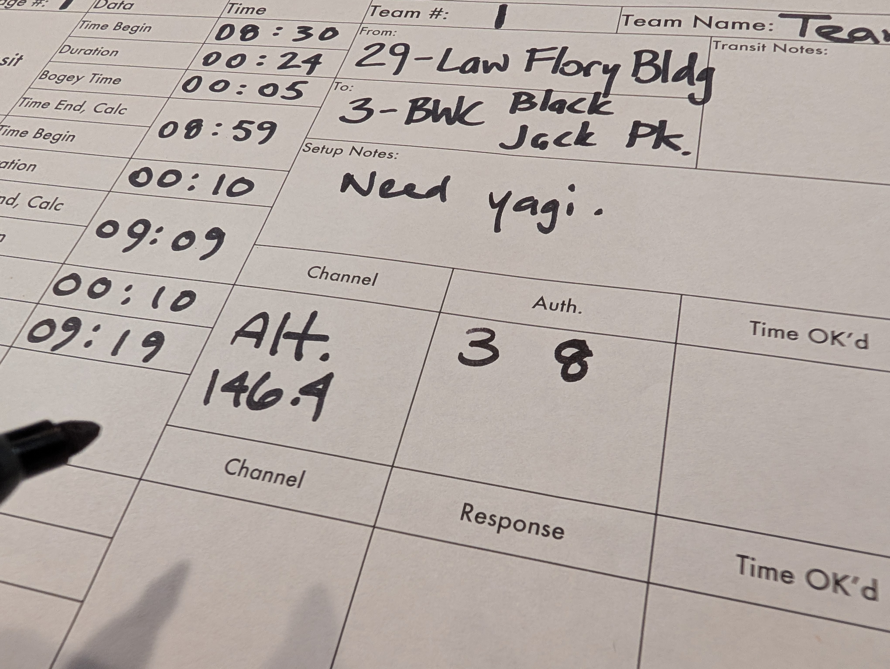

Now look down on row 3, and over to column 8. Respond with the indicated letter.

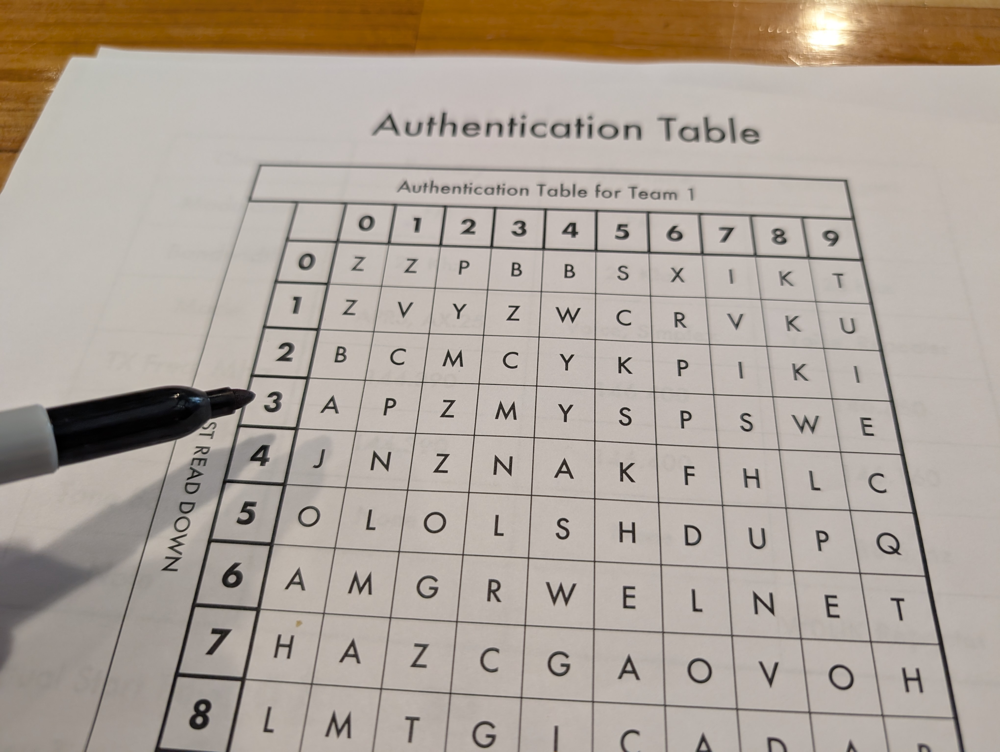
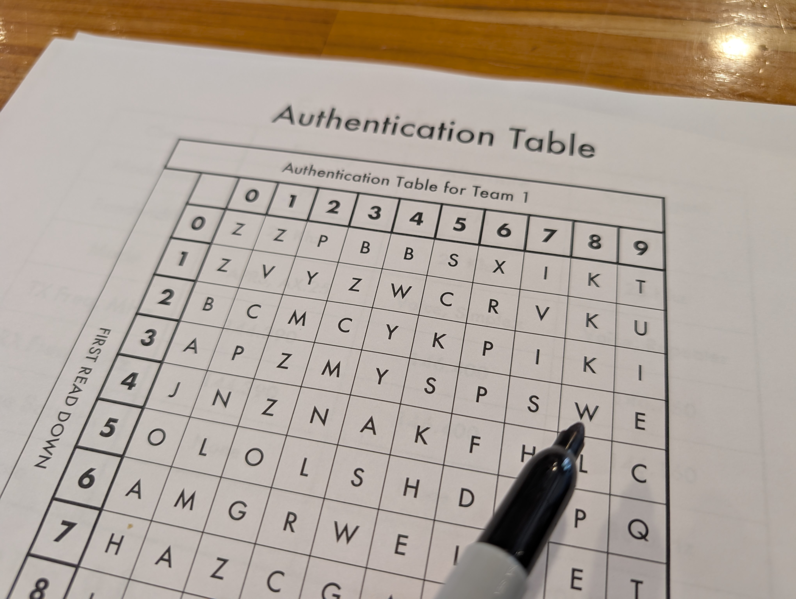

**Team:** “Net control, Team QRM authenticates Whiskey.”

**Net Control:** “Team QRM good authentication at 09:14, your task is Bravo.”

**Team:** “Good authentication at 09:14, our task is Bravo.”

**Net Control:** “All correct, net control out.”

**Team:** “All correct, Team QRM out.”

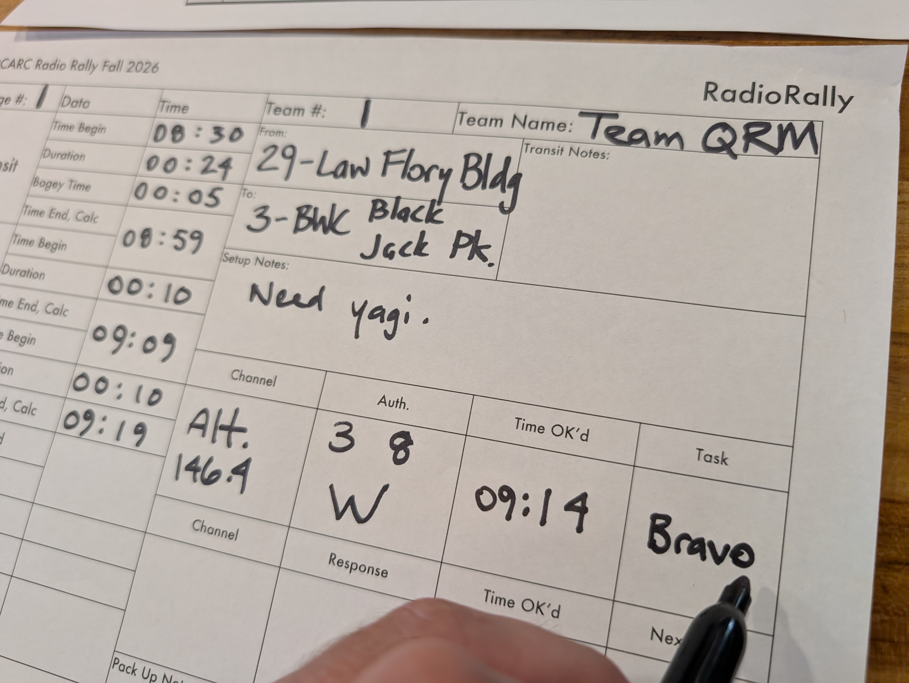

Copy the OK time into the box between the check-in section and the task section.

Task
==
Among your task envelopes, locate the envelopes for your current location and the task indicated by net control. Only open the correct envelope. Teams must turn unused and unopened envelopes back in to net control or will be penalized.

Remove the paper inside and record the task duration and determine your response window. Search the local area for the answer and reply to net control within that window. Use the following script as a guide to communicate with net control.

**Team:** “Radio Rally Net Control this is KI4RXJ calling for Team QRM.”

**Net Control:** “Net Control Answering, go ahead Team QRM.”

**Team:** “Team QRM responding for Stage 1 Location 3 Task Bravo”

**Net Control:** “Roger, Team QRM, ready to copy Task Bravo.”

**Team:** “Net control, Task Charlie response is New Franklin, MO.”

**Net Control:** “Net control acknowledges Bravo response New Franklin, MO as correct from Team QRM at 09:31. Your next location is 40, Four-Zero.”

**Team:** “Response is correct at 09:31. Next location is 40, Four-Zero.”

**Net Control:** “All correct, net control out.”

**Team:** “All correct, Team QRM out.”

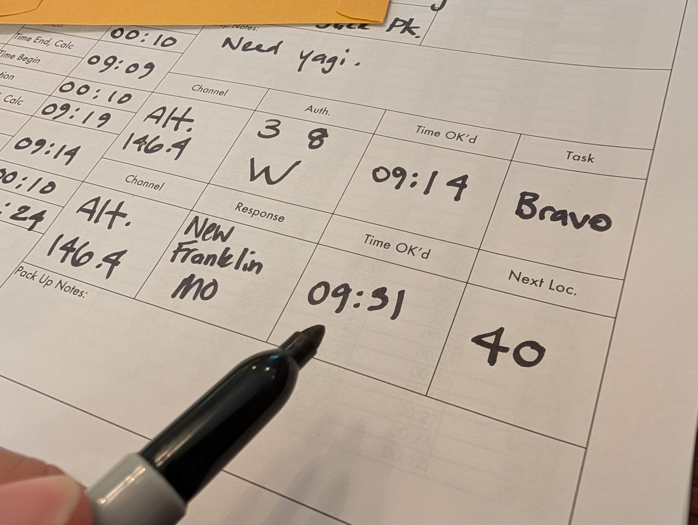

Pack Up
==

With the OK time from net control and the pack up time in your packet, calculate the end time of the stage. The end time of the stage can then be copied to the beginning time on the next stage sheet.

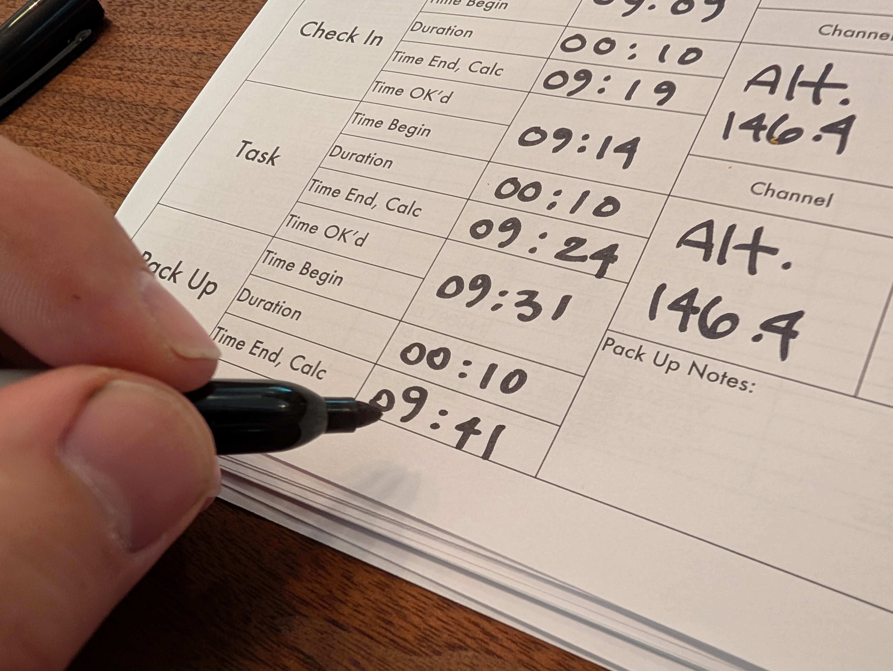

Now you can pack up your station and clean up any trash or other materials. Be sure to leave the area better than you found it!

Debriefing
==
After the last stage is completed, teams will drive to the event headquarters. The organizer will design each team's schedule so all teams arrive at the headquarters for debriefing within approximately five to ten minutes of each other.

Upon arrival, turn your materials in to the organizer. The organizer will ask you to fill out a brief survey to help make the next event better. When all teams have arrived, the debriefing will start. Each team will have a designee share what they learned, what went well, and what could be improved. 

After all teams have shared their thoughts, the organizer will recognize the team who scored the most points.

