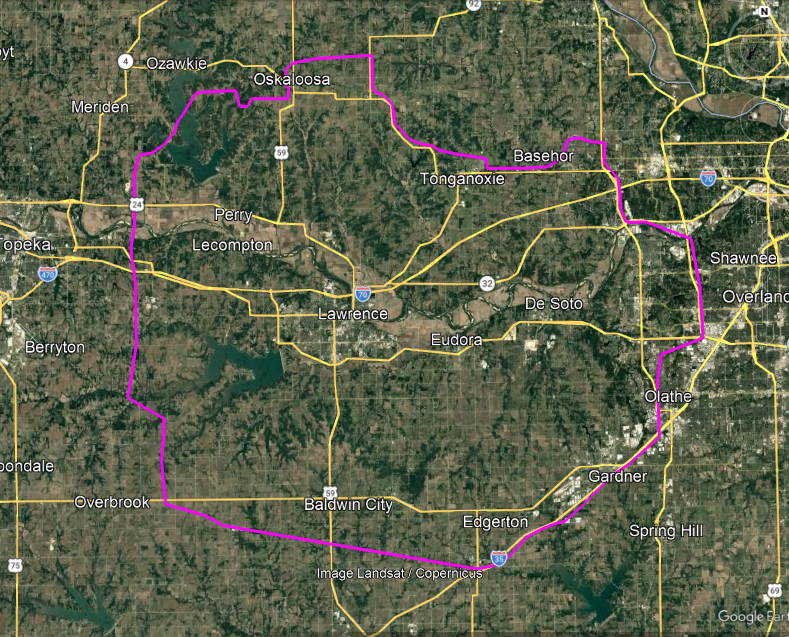
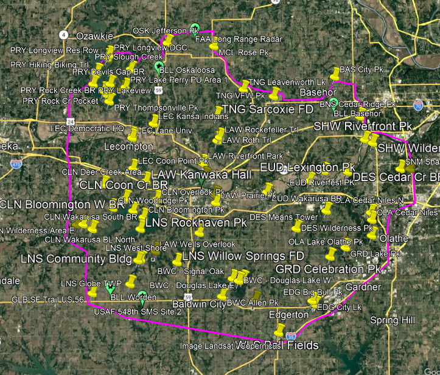

# Event Organizing
This section is for resources for event organizers. Organizers should have redundancies in nearly every area to ensure smooth event operation.

Use the [event planning spreadsheet](./radio_rally_planning.ods) to plan and operate the event. (LibreOffice ODS file)

## 1. Area of Operations
First, design your event around a core geographic area and the bands you plan to use.

Half-day county-wide events on VHF/UHF generally cover 1,000 sqare miles, or about 32 miles x 32 miles. Shoot for a maximum 20-25 minute drive in either direction from the core.

HF events using NVIS propagation generally cover larger areas. Shoot for about 6,000 square miles, or about 75 miles x 75 miles. Plan for a maximum 45-50 minute drive in either direction from the core. 

City-wide events are approximately 100 square miles, or 10 miles x 10 miles. Try to keep city-wide events with no more than 10 to 15 minutes of drive time between locations.

In either case, the area doesn't have to be square. Adjust the area as needed.

## 2. Bands
Select bands that are accessible to your participants, and order them from most difficult to least difficult. Don't forget that technicians can also use 10 meters and 6 meters! Teams can score more points using the more challenging primary channel.

- **Primary Channel** : Select the primary channel that is a reasonable challenge to operators. For example, if your club is trying to promote DMR, make the primary channel DMR.

- **Alternate Channel** : Select an alternate channel that is accessible by most operators, but may still be a reasonabl challenge. For example, the alternate channel might be simplex UHF voice. Many teams should be able to do UHF voice, but depending on the operating locations, teams may need to erect masts, or find other ways to get extra height on the antenna to make a successful contact.

- **Contingent Channel** : Select a contingent channel that is accessible to all operators and be straightforward in setup. Usually, this is a local repeater that has good coverage in the area. Be sure to get permission from the repeater owner to conduct your event!

Here are some ideas for bands and channels.

- **E = Easy (Technician Friendly)**
- **M = Medium**
- **C = Challenging**

**VHF / UHF**

| Band | FM Voice | DMR Voice | SSB Voice | APRS | JS8Call | VARA FM | VARA HF | MT63 | Meshcore |
| ----------- | ----------- | ----------- | ----------- | ----------- | ----------- | ----------- | ----------- | ----------- | ----------- |
| 10 m |E|C|E|M|E|M|M|M|N/A|
| 6 m |E|C|E|E|E|E|M|M|N/A|
| 2 m |E|E|C|E|E|E|N/A|M|N/A|
| 70 cm |E|E|C|E|E|E|N/A|M|N/A|
| 33 cm |C|C|C|C|C|C|N/A|C|E|

**HF**

| Band | SSB Voice | JS8Call | RTTY | HELL | Winlink |
| ----------- | ----------- | ----------- | ----------- | ----------- | ----------- |
| 6 m |E|E|E|M|M|
| 10 m |E|E|E|E|M|
| 40 m |M|E|C|C|M|
| 60 m |C|C|C|C|C|
| 80 m |C|C|C|C|C|

## 3. Event Format
Select a format of your event based on tasks and operating locations using the M x N format.
- M = number of operating locations
- N = number of tasks per operating location

Example:
- A 3 x 1 event consists of three operating locations and one task to perform at each operating location at the given time.
- A 1 x 3 event consists of one operating location and three tasks to perform at the operating location at various times during the event.
- A 2 x 2 event consists of two operating locations and two tasks to perform while at a given operating location. Tasks are to be performed at different times per the event's instructions.

If you're not sure how to structure an event, start with a county-wide 3 x 1 event.

## 4. Operating Locations
Within the area of operations, select enough operating locations to have a good balance of familiar locations (larger parks and public areas) and lesser known locations (roadside and rural parks). Do not go below 30 operating locations per 1,000 sq miles. 30 locations provides just enough uncertainty for participants on where they will operate. 30 locations also provides for about eight teams without duplicating locations. Add more sites if they provide a good radio, trivia, or geographic challenge. Add more sites if you wish to host more than eight teams. Do not exceed 70 operating locations per 1,000 sq miles, as managing the data and tasks for the event become burdensome at that level.

Use this spreadsheet to organize and operate your event.
[event planning spreadsheet](./radio_rally_planning.ods)

## 4. Check In and Tasks
### Check In
For each location, a team must check in within their window. Teams do not have to be exactly at the location for successful check in, but the important thing is that they check in on time. To ensure net control is speaking with the correct team, each team is issued a unique authentication table at the beginning of the event. Use the provided spreadsheet to generate an authentication table. Copy-and paste the table as an image into the information packet for the teams. Check ins are recorded by net control, and an official time is given to the team.

### Tasks
For each location, have a minimum of four tasks that can be completed by teams. More variety is better. Tasks should fall under the following categories:
1. Observation
2. Measurement
3. Communication

#### Observation
Observation tasks require a team to carefully observe their surroundings and report on their findings. For example, a team may need to find a historical marker, sign, or other object and report on what is displayed.
> "According to the historical marker nearby, who was the last serving postmaster of the town? (J.T. McMillan)
> "At this location, there is a picnic shelter. How many picnic tables are under the shelter?" (Eight Picnic Tables)
> "At this location, there is a sign indicating the operator of the quarry. What is the telephone number of the quarry office? (785-555-3182)

#### Measurement
Measurement tasks require a team to physically interact with something in their surroundings. A measurement might require a tape measure, inclinometer, or other tool. Organizers may elect to provide the tool or have the teams provide their own.
> "Using the provided tape measure, what is the the inside width (in inches) of the footpath bridge at this location? (72 inches)
> "Using the provided inclinometer, what is the angle of the boat ramp as measured just above the water line? (10 degrees from horizontal)

#### Communication
Communication tasks require a team to handle complex information or retrieve information from another source.
> Tongue Twister - "At this location there is a unique club flyer posted on the bulletin board. What is the phrase written at the bottom of the flyer?" ("A proper copper coffee pot.")
> Similar Sounds - "Which statement on your task card matches what is found posted at your location?"
- "Sixteen characters make up hexadecimal numbers"
- "Sixty caricatures make up ecumenical blunders"
- "Thrifty managers take up influential wonders"
- "Screened inheritors take up rebuttal plunders"
> Radio Relay - use your radio to relay information from another station
- "Near this location is a hidden transmitter tuned to 146.400 MHz. The transmitter reports temperature and time every seven minutes by voice message. Listen for the transmission and record the time and temperature. Report the results back to net control.
- "Near this location is a hidden transmitter tuned to 446.400 MHz. Key up your radio on the channel and dial "1617" on your keypad to trigger a response. Record the response and report the response to net control."
- "Near this location is another amateur radio operator, KI4RXJ, who is monitoring 146.400 MHz. Make contact with them and ask for the mileage on their vehicle. Report this number back to net control." 

## 5. Net Control and HQ Setup
Several of your locations should be suitable to serve as HQ for an event. Try to locate them at shelters or buildings where picnic tables and bathrooms are available. Get at least two others to help you run the event and run net control. You will need to set up a temporary stations for all channels, and you should also have a backup plan for each station, including radio, coax, and antenna. Do not allow more than 5 people to participate in net control or organizing activities as this will complicate operations and decision making.

If you set up a mobile HQ be sure you have plenty of solar, battery, or generator power to last the entire day. Use a program like Radio Mobile to simulate the radio links between your station and your operating locations. Make the link a challenge, but don't make it too hard.

Radio Rally © 2026 by KI4RXJ Darrell Krueger is licensed under CC BY-NC-SA 4.0 
